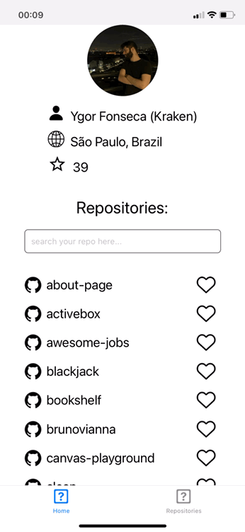
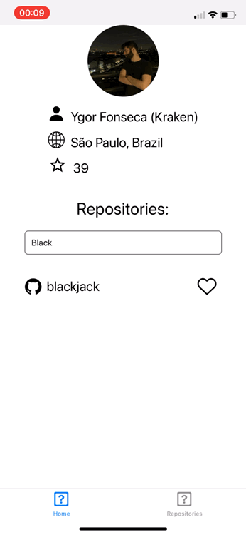

# Teste React Native:

O Objetivo desse teste é avalair os conhecimentos de javascript, react native, es6.

Abaixo temos uma demonstração da UX desejada. A idéia é usar a api do GITHUB para exibir os dados do seu profile e de seus repositórios e adicionar um button para favoritar cada repositório. Os reposítórios favoritados devem ser armazenados na storage do smarthpone e listados em uma segunda tela.

Requisítos mínimos:

- Home exibindo as informações do user (nome, cidade, quantidade de seguidores)
- Input de search para filtrar os repositórios listados
- Opção para favoritar repositório
- Barra de navegação
- Tela de repositórios listando todos os repositórios favoritados

Improvments:

Seria ótimo alguns testes de integração/e2e para garantir que o app funcione perfeitamente :)

Testes integração (react-native-testing-library)
Testes e2d (detox)

Github API:

[Documentação](https://docs.github.com/en/rest)

Screenshots:

